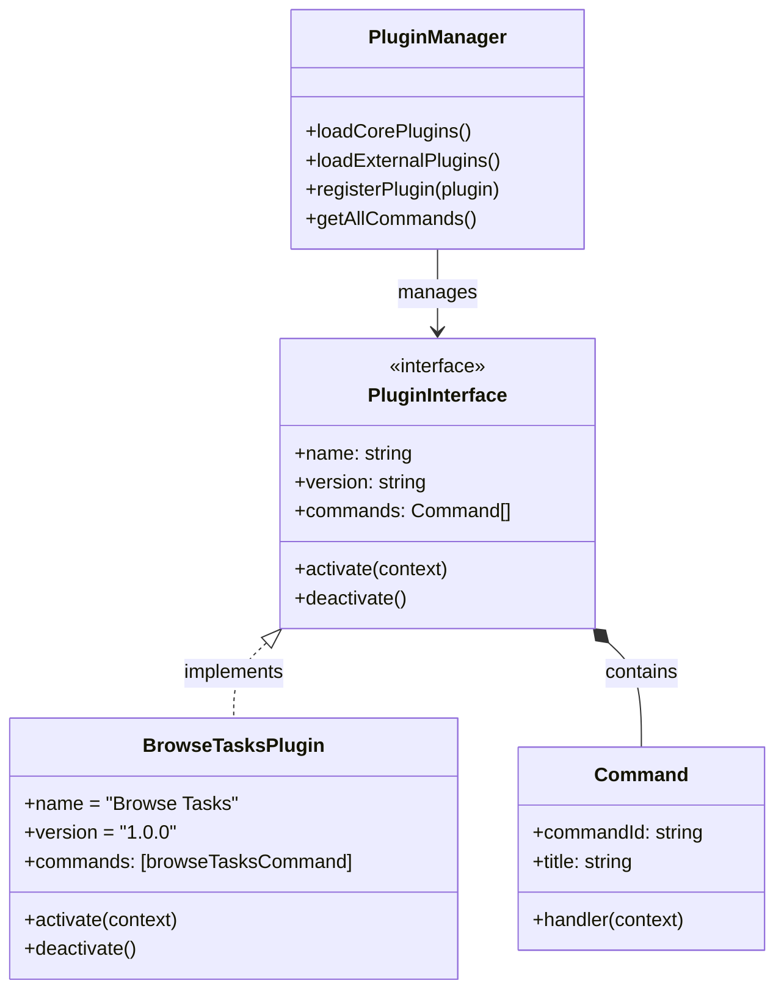

# RooBoost Plugin Architecture

## Overview



## Plugin Interface

```typescript
interface Plugin {
    // Unique name of the plugin
    name: string;
    
    // Semantic version of the plugin
    version: string;
    
    // Commands this plugin provides
    commands: Command[];
    
    // Called when extension activates
    activate(context: vscode.ExtensionContext): void;
    
    // Called when extension deactivates
    deactivate(): void;
}

interface Command {
    // VS Code command ID (e.g. 'rooboost.browseTasks')
    commandId: string;
    
    // Human-readable title
    title: string;
    
    // Command handler function
    handler: (context: vscode.ExtensionContext) => void;
}
```

## Plugin Manager

```typescript
class PluginManager {
    private plugins: Plugin[] = [];
    
    // Register a new plugin
    registerPlugin(plugin: Plugin) {
        this.plugins.push(plugin);
    }

    // Activate all registered plugins
    activateAll(context: vscode.ExtensionContext) {
        this.plugins.forEach(plugin => {
            try {
                plugin.activate(context);
            } catch (err) {
                console.error(`Failed to activate plugin ${plugin.name}:`, err);
            }
        });
    }

    // Deactivate all plugins
    deactivateAll() {
        this.plugins.forEach(plugin => {
            try {
                plugin.deactivate();
            } catch (err) {
                console.error(`Failed to deactivate plugin ${plugin.name}:`, err);
            }
        });
    }
}
```

## Example Plugin Implementation

```typescript
class BrowseTasksPlugin implements Plugin {
    name = "Browse Tasks";
    version = "1.0.0";
    
    commands = [{
        commandId: 'rooboost.browseTasks',
        title: 'Browse Tasks',
        handler: this.activate.bind(this)
    }];

    private panel?: vscode.WebviewPanel;

    activate(context: vscode.ExtensionContext) {
        this.panel = createTaskBrowserPanel(context);
    }

    deactivate() {
        this.panel?.dispose();
    }
}
```

## Extension Integration

```typescript
const pluginManager = new PluginManager();

export function activate(context: vscode.ExtensionContext) {
    // Load core plugins
    pluginManager.registerPlugin(new BrowseTasksPlugin());
    
    // Load external plugins from configured directories
    loadExternalPlugins(pluginManager);
    
    pluginManager.activateAll(context);
}

export function deactivate() {
    pluginManager.deactivateAll();
}
```

## External Plugin Loading

1. Plugins should be placed in:
   - `~/.rooboost/plugins` (user plugins)
   - `./plugins` (workspace plugins)

2. Each plugin must:
   - Be in its own directory
   - Have a `package.json` with:
     ```json
     {
       "name": "plugin-name",
       "version": "1.0.0",
       "main": "./dist/index.js",
       "engines": {
         "vscode": "^1.75.0"
       }
     }
     ```
   - Export a default class implementing the `Plugin` interface